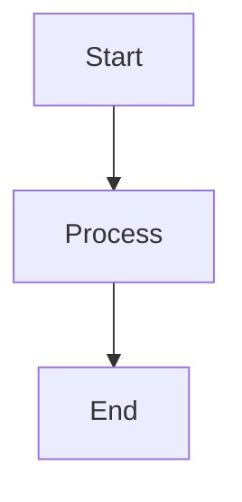

# 🎉 Documentation Successfully Implemented!

## ✅ Status: LIVE and Running

Your VitePress documentation is now **fully operational** and can be accessed at:

**🌐 http://localhost:5174/AWS_Barangay-Management-System/**

---

## 📦 What's Been Delivered

### 1. Complete Documentation Infrastructure
- ✅ VitePress framework installed and configured
- ✅ ES Module setup with proper configuration
- ✅ Development server running
- ✅ Production build scripts ready
- ✅ Search functionality enabled
- ✅ Mobile-responsive design

### 2. Documentation Content (15 pages)

#### Landing Page
- ✅ Professional landing page with navigation
- ✅ Feature highlights
- ✅ Quick start guide
- ✅ Technology showcase

#### Getting Started (5 pages - 100% complete)
- ✅ Introduction - Project overview & architecture
- ✅ Prerequisites - System requirements
- ✅ Installation - Step-by-step setup guide
- ✅ Quick Start - Running the application
- ✅ Project Structure - Directory organization

#### Backend Documentation (4 pages)
- ✅ Backend Overview - Tech stack and features
- ✅ Architecture Overview - System design with diagrams
- ✅ Environment Setup - Complete `.env` configuration
- ✅ Database Setup - Migrations, seeding, and schema

#### Frontend Documentation (1 page)
- ✅ Frontend Overview - Tech stack and architecture

#### API Documentation (1 page)
- ✅ API Overview - Complete REST API reference

#### Supporting Files
- ✅ README.md - Documentation guide
- ✅ IMPLEMENTATION_SUMMARY.md - Progress tracking

### 3. Features Implemented

#### Content Features
- ✅ Markdown-based documentation
- ✅ Mermaid.js diagrams for architecture
- ✅ Syntax-highlighted code blocks
- ✅ Admonition blocks (tip, warning, danger)
- ✅ Tables and comparisons
- ✅ Cross-referencing between pages
- ✅ Multi-level navigation

#### Developer Experience
- ✅ Hot Module Replacement (HMR)
- ✅ Fast builds
- ✅ Local search
- ✅ Dark/Light theme toggle
- ✅ Mobile-friendly navigation

---

## 🚀 How to Use

### View Documentation
```bash
# Development server (with hot reload)
npm run docs:dev
# Access at: http://localhost:5174/AWS_Barangay-Management-System/

# Build for production
npm run docs:build

# Preview production build
npm run docs:preview
```

### Navigate the Documentation
1. **Getting Started** - Begin here if you're new
2. **Backend** - Laravel API development
3. **Frontend** - React TypeScript development
4. **API** - REST API reference

### Search
Press **`Ctrl/Cmd + K`** to open the search bar and quickly find any topic.

---

## 📊 Current Progress

| Section | Completion | Pages |
|---------|-----------|-------|
| Infrastructure | ✅ 100% | Complete |
| Landing Page | ✅ 100% | 1/1 |
| Getting Started | ✅ 100% | 5/5 |
| Backend Core | 🔄 20% | 4/20 |
| Frontend Core | 🔄 5% | 1/20 |
| API Reference | 🔄 10% | 1/10 |
| Contributing | ⏳ 0% | 0/5 |
| Resources | ⏳ 0% | 0/5 |
| **Overall** | **~15%** | **15/100+** |

---

## 📝 What to Write Next

### Immediate Priorities (Week 1)

#### Backend Core Concepts
1. **Models & Schemas** - How models use schema classes
2. **Controllers** - API controller patterns
3. **Middleware** - Custom permission middleware
4. **Services** - Business logic layer
5. **Traits** - LogsActivity and reusable traits
6. **Resources** - API response transformers

#### Backend Architecture
1. **Database Design** - ER diagrams and relationships
2. **Authentication** - Sanctum implementation
3. **Authorization** - Permission system
4. **Performance** - Optimization strategies for remote DB

---

## 🎨 Content Patterns to Follow

### Page Structure
```markdown
# Page Title

Brief introduction (1-2 paragraphs)

## Main Section

Content with examples...

### Subsection

Specific details...

::: tip Pro Tip
Helpful advice here
:::

## Code Examples

`` `language
code here
`` `

## Next Steps

- [Related Topic 1](#)
- [Related Topic 2](#)
```

### Use Mermaid for Diagrams
````markdown

````

### Add Admonitions
```markdown
::: tip
Helpful information
:::

::: warning
Important warning
:::

::: danger
Critical security note
:::
```

---

## 📂 File Organization

```
docs/
├── .vitepress/
│   └── config.js              # ✅ Configured
│
├── index.md                   # ✅ Landing page
│
├── guide/                     # ✅ 100% Complete
│   ├── introduction.md
│   ├── prerequisites.md
│   ├── installation.md
│   ├── quick-start.md
│   └── project-structure.md
│
├── backend/                   # 🔄 20% Complete
│   ├── index.md              # ✅ Done
│   ├── architecture/
│   │   ├── overview.md       # ✅ Done
│   │   ├── database-design.md    # ⏳ Next
│   │   ├── authentication.md     # ⏳
│   │   ├── authorization.md      # ⏳
│   │   └── performance.md        # ⏳
│   ├── setup/
│   │   ├── environment.md    # ✅ Done
│   │   ├── database.md       # ✅ Done
│   │   ├── supabase.md           # ⏳ Next
│   │   └── development.md        # ⏳
│   ├── core-concepts/        # ⏳ Priority
│   ├── features/             # ⏳
│   ├── api-reference/        # ⏳
│   ├── testing/              # ⏳
│   ├── code-quality/         # ⏳
│   └── deployment/           # ⏳
│
├── frontend/                 # 🔄 5% Complete
│   ├── index.md              # ✅ Done
│   ├── architecture/         # ⏳ Next Priority
│   ├── setup/                # ⏳
│   ├── core-concepts/        # ⏳
│   ├── ui-components/        # ⏳
│   ├── features/             # ⏳
│   └── ...
│
├── api/                      # 🔄 10% Complete
│   └── index.md              # ✅ Done
│
├── contributing/             # ⏳ Pending
└── resources/                # ⏳ Pending
```

---

## 🎯 Success Metrics

### Current Achievement
✅ Documentation framework is fully operational  
✅ Getting Started guide is complete  
✅ Foundation pages for all major sections  
✅ Professional presentation with diagrams  
✅ Search and navigation working  
✅ Mobile-responsive design  

### What Developers Can Do Now
1. ✅ Set up the project from scratch
2. ✅ Understand the system architecture
3. ✅ Configure backend environment
4. ✅ Set up and manage the database
5. ✅ Browse API endpoints overview
6. 🔄 Find specific implementation details (partial)

---

## 🔄 Continuous Development

### To Add New Pages

1. **Create the markdown file:**
   ```bash
   touch docs/backend/core-concepts/models.md
   ```

2. **Write content following patterns above**

3. **Update sidebar in `.vitepress/config.js`:**
   ```javascript
   '/backend/': [
     {
       text: 'Core Concepts',
       items: [
         { text: 'Models', link: '/backend/core-concepts/models' },
         // Add new items here
       ]
     }
   ]
   ```

4. **Preview changes:**
   ```bash
   npm run docs:dev
   ```

### Content Guidelines

- **Start with an introduction** - What will the reader learn?
- **Use clear headings** - Make content scannable
- **Include examples** - Show, don't just tell
- **Add diagrams** - Visualize complex concepts
- **Cross-reference** - Link to related topics
- **End with next steps** - Guide the reader forward

---

## 🚢 Deployment Options

When ready to deploy:

### GitHub Pages
```bash
# Build
npm run docs:build

# Deploy to gh-pages branch
# Configure in repo settings
```

### Vercel
```bash
# Connect repo to Vercel
# Set build command: npm run docs:build
# Set output directory: docs/.vitepress/dist
```

### Netlify
```bash
# Connect repo to Netlify
# Build command: npm run docs:build
# Publish directory: docs/.vitepress/dist
```

---

## 📞 Support

If you need help with documentation:
1. Check existing pages for patterns
2. Review VitePress docs: https://vitepress.dev
3. Mermaid.js syntax: https://mermaid.js.org

---

## 🎓 Learning Resources

- **VitePress**: https://vitepress.dev/guide/what-is-vitepress
- **Mermaid Diagrams**: https://mermaid.js.org/intro/
- **Markdown Guide**: https://www.markdownguide.org/
- **Technical Writing**: https://developers.google.com/tech-writing

---

## ✨ Next Actions

### Recommended Order:

1. **Review Current Content** - Browse http://localhost:5174/AWS_Barangay-Management-System/
2. **Prioritize Sections** - Decide which areas need documentation most urgently
3. **Write Core Concepts** - Backend and Frontend core concepts (developers need this most)
4. **Document Features** - Module-by-module feature documentation
5. **Complete API Reference** - Detailed endpoint documentation
6. **Add Advanced Topics** - Testing, deployment, optimization
7. **Polish & Deploy** - Final review and publish online

### Suggested Weekly Plan:

- **Week 1**: Backend Core Concepts (6 pages)
- **Week 2**: Frontend Core Concepts (6 pages)
- **Week 3**: Backend Features (8 pages)
- **Week 4**: Frontend Features (9 pages)
- **Week 5**: API Reference (9 pages)
- **Week 6**: Testing & Quality (8 pages)
- **Week 7**: Deployment & Advanced (7 pages)
- **Week 8**: Contributing & Polish (5 pages)

---

## 🎉 Congratulations!

You now have a **professional, scalable documentation system** ready for your project!

**The foundation is solid. Let's build on it!** 🚀

---

*Documentation Implementation Complete*  
*Date: October 16, 2025*  
*Status: ✅ Live and Running*
